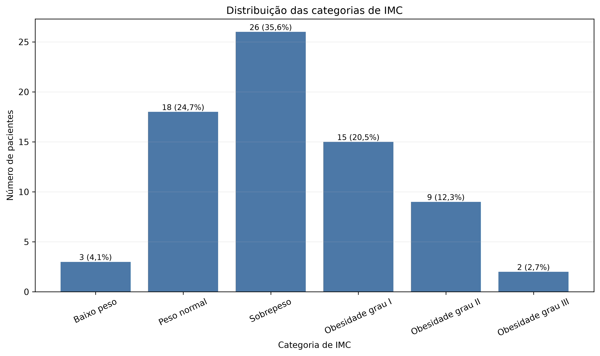
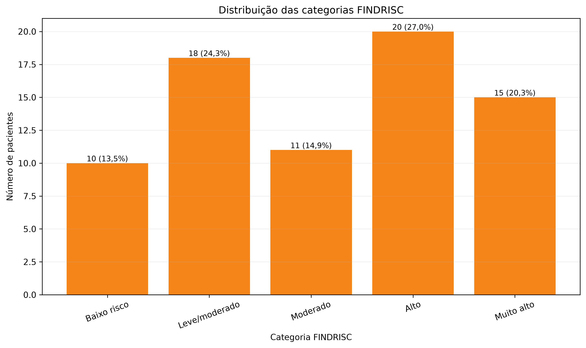
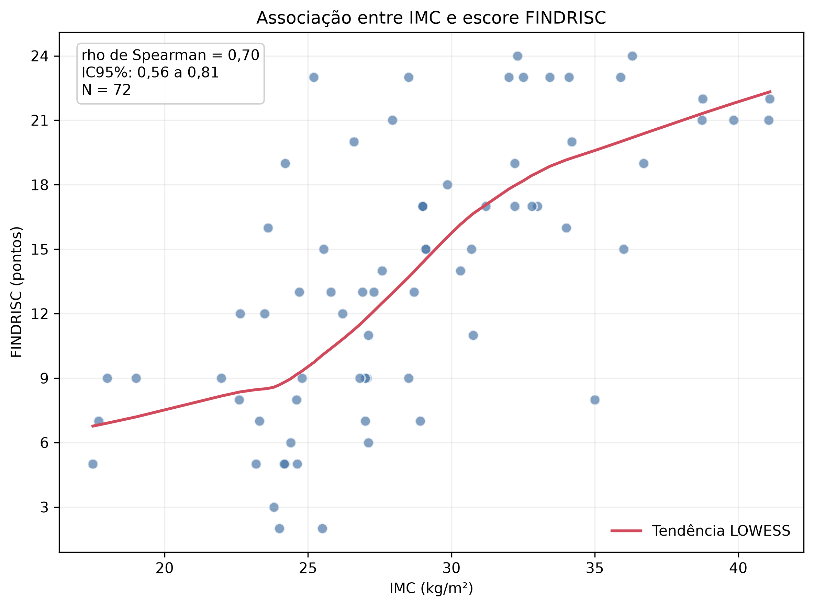
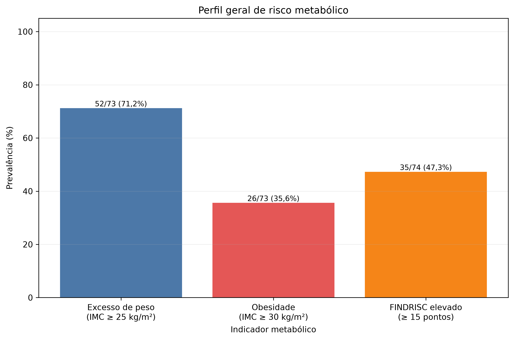

# IMC e FINDRISC em pacientes com doenças autoimunes

Análise exploratória, reproduzível e anonimizada do perfil nutricional e do risco de desenvolvimento de diabetes mellitus tipo 2 em pacientes com doenças autoimunes acompanhados em um hospital.

O estudo responde principalmente à seguinte pergunta:

> Existe associação entre o estado nutricional, avaliado pelo IMC, e o risco de desenvolvimento de diabetes mellitus tipo 2, avaliado pelo FINDRISC, nesta amostra hospitalar de pacientes com doenças autoimunes?

Este README apresenta os resultados técnicos e explica os termos estatísticos para que o material possa ser lido também por pessoas sem formação em estatística ou saúde.

## Resumo em linguagem direta

O arquivo original possuía 100 linhas, mas somente 75 correspondiam a pacientes preenchidos. Entre esses pacientes:

- 73 possuíam IMC válido;
- 74 possuíam FINDRISC válido;
- 72 possuíam simultaneamente IMC e FINDRISC válidos;
- 71,23% apresentavam excesso de peso;
- 35,62% apresentavam obesidade;
- 47,30% apresentavam FINDRISC igual ou superior a 15 pontos.

Foi observada associação positiva entre IMC e FINDRISC: pacientes com maiores valores de IMC tenderam a apresentar maiores escores FINDRISC. Isso não significa que o IMC tenha causado o aumento do FINDRISC. Além de o estudo ser observacional, o próprio IMC é um dos componentes usados no cálculo do FINDRISC, fazendo com que parte da associação seja esperada pela construção matemática do escore.

## O que são as principais variáveis

### IMC

O Índice de Massa Corporal é uma medida que relaciona peso e altura, expressa em kg/m². Neste projeto, o IMC já estava registrado no banco. Como altura e peso estavam completamente ausentes, não foi possível recalculá-lo de forma independente.

As categorias utilizadas foram:

| IMC | Categoria |
|---:|---|
| Menor que 18,5 | Baixo peso |
| 18,5 a menor que 25 | Peso normal |
| 25 a menor que 30 | Sobrepeso |
| 30 a menor que 35 | Obesidade grau I |
| 35 a menor que 40 | Obesidade grau II |
| 40 ou mais | Obesidade grau III |

Foram criados dois indicadores derivados:

- **Excesso de peso:** IMC maior ou igual a 25 kg/m².
- **Obesidade:** IMC maior ou igual a 30 kg/m².

Quando o IMC estava ausente, esses indicadores também permaneceram ausentes. Missing não foi convertido em `False` ou zero.

### FINDRISC

O FINDRISC é um escore de rastreamento do risco futuro de diabetes mellitus tipo 2. Ele não é um diagnóstico de diabetes e sua pontuação não deve ser interpretada isoladamente como probabilidade individual exata.

As categorias foram recalculadas exclusivamente a partir da pontuação:

| Pontuação | Categoria |
|---:|---|
| Menor que 7 | Baixo risco |
| 7 a 11 | Leve/moderado |
| 12 a 14 | Moderado |
| 15 a 20 | Alto |
| Maior que 20 | Muito alto |

O indicador **FINDRISC elevado** representa pontuação maior ou igual a 15, reunindo as categorias de risco alto e muito alto.

### Outras variáveis

A caracterização da população também incluiu, quando disponíveis:

- estado civil, escolaridade, renda e ocupação;
- diagnóstico autoimune;
- tempo de diagnóstico;
- uso de corticoide e imunobiológico;
- comorbidades e medicamentos;
- tabagismo, etilismo e atividade física;
- circunferências cervical e abdominal;
- exames laboratoriais.

Os diagnósticos específicos foram usados para descrição. A análise principal manteve todos os pacientes com doenças autoimunes como uma única coorte, sem comparar doenças entre si.

## Como interpretar as métricas

| Termo | Explicação em linguagem simples |
|---|---|
| **N** | Número de pacientes efetivamente incluídos naquele cálculo. Pode variar entre análises por causa de dados ausentes. |
| **N válido** | Quantidade de observações preenchidas e utilizáveis para uma variável. |
| **Missing** | Dado ausente. Não foi substituído por zero, `False` ou valor estimado. |
| **Média** | Soma dos valores dividida pelo número de observações. Pode ser influenciada por valores extremos. |
| **Moda** | Valor que aparece mais vezes. Pode existir mais de uma moda ou ela pode não ser informativa. |
| **Desvio-padrão (DP)** | Medida da dispersão em torno da média. DP maior indica valores mais espalhados. |
| **Mediana** | Valor central após ordenar os dados. Metade das observações fica abaixo e metade acima. |
| **P25** | Valor abaixo do qual estão aproximadamente 25% das observações. |
| **P75** | Valor abaixo do qual estão aproximadamente 75% das observações. |
| **P25–P75** | Intervalo que contém a metade central dos dados. Também é chamado de intervalo interquartil. |
| **n (%)** | Contagem e percentual. O denominador foi sempre o N válido da variável. |
| **Prevalência** | Percentual da amostra que apresenta determinada característica. Aqui descreve somente esta amostra hospitalar. |
| **rho de Spearman** | Mede se duas variáveis tendem a aumentar ou diminuir juntas, usando a ordem dos valores. Varia de −1 a +1. |
| **IC95%** | Faixa de incerteza da estimativa. Intervalos mais estreitos indicam maior precisão. |
| **p-valor** | Mede a compatibilidade dos dados com uma hipótese de ausência de associação. Não informa a importância clínica nem a probabilidade de a hipótese ser verdadeira. |
| **Bootstrap** | Reamostragem computacional usada para estimar o IC95%. Foram utilizadas 10.000 reamostragens com seed 42. |
| **Mann–Whitney** | Teste usado nas análises secundárias para comparar a distribuição de dois grupos independentes. |
| **Correlação bisserial de postos** | Tamanho de efeito das comparações secundárias. O sinal mostra a direção e o módulo mostra a magnitude do contraste entre os grupos. |
| **Ajuste de Holm** | Correção aplicada quando vários testes relacionados são realizados, reduzindo o risco de achados positivos ao acaso. |
| **LOWESS** | Linha suavizada usada apenas para mostrar visualmente a tendência no gráfico de dispersão. Não representa um modelo causal. |

Um p-valor pequeno não deve ser lido sozinho. A interpretação científica deve considerar o N, a magnitude do efeito, o IC95%, o desenho do estudo e a plausibilidade clínica.

## Fluxo da análise

```text
CSV bruto
   ↓
Auditoria e identificação dos pacientes válidos
   ↓
Limpeza, padronização e anonimização
   ↓
Dataset processado
   ↓
Descrição da população e EDA de IMC/FINDRISC
   ↓
Análise principal IMC × FINDRISC
   ↓
Análises secundárias e de sensibilidade
   ↓
Tabelas e figuras finais
```

O arquivo em `data/raw/` nunca é modificado. Todas as transformações são executadas por código e produzem um novo dataset anonimizado.

## Relatório técnico final

### Dataset

| Indicador | Resultado |
|---|---:|
| Linhas no arquivo original | 100 |
| Pacientes válidos | 75 |
| Linhas removidas por ausência de paciente | 25 |
| Duplicatas exatas | 0 |
| N final anonimizado | 75 |
| Pacientes com IMC e FINDRISC válidos | 72 |

Somente registros sem paciente foram removidos. Não houve imputação nem exclusão de valores extremos verdadeiros.

### Dados ausentes

| Variáveis | N ausente | Percentual ausente |
|---|---:|---:|
| Altura, peso, BASDAI, SLICC e DAS-28 | 75 | 100,00% |
| VRDL | 74 | 98,67% |
| Pressão arterial | 70 | 93,33% |
| Glicemia e HbA1c | 53 | 70,67% |
| HDL e triglicerídeos | 52 | 69,33% |
| Colesterol total e LDL | 51 | 68,00% |
| Tempo de medicamento | 40 | 53,33% |
| IMC | 2 | 2,67% |
| FINDRISC | 1 | 1,33% |

Os exames laboratoriais com elevada ausência não foram usados como eixos inferenciais. Nenhum dado ausente foi imputado.

### IMC

| Estatística | Resultado |
|---|---:|
| N válido | 73 |
| Média | 28,72 kg/m² |
| Moda | 29 kg/m² |
| Desvio-padrão | 5,50 kg/m² |
| Mediana | 27,94 kg/m² |
| P25–P75 | 24,62–32,30 kg/m² |
| Mínimo–máximo | 17,50–41,10 kg/m² |
| Excesso de peso | 52/73 (71,23%) |
| Obesidade | 26/73 (35,62%) |

Não foram identificados valores biologicamente implausíveis ou outliers pelo critério de 1,5 vez o intervalo interquartil. Nenhum IMC foi excluído.

### FINDRISC

| Estatística | Resultado |
|---|---:|
| N válido | 74 |
| Média | 13,76 pontos |
| Moda | 9 pontos |
| Desvio-padrão | 6,25 pontos |
| Mediana | 14 pontos |
| P25–P75 | 9–19 pontos |
| Mínimo–máximo | 2–24 pontos |
| FINDRISC ≥15 | 35/74 (47,30%) |
| IC95% para FINDRISC ≥15 | 36,34%–58,52% |

A categoria mais frequente foi **Alto**, com 20 de 74 pacientes com FINDRISC válido (27,03%).

### Associação principal

Foram incluídos somente pacientes com IMC e FINDRISC válidos.

| Indicador | Resultado |
|---|---:|
| N | 72 |
| rho de Spearman | 0,704 |
| IC95% bootstrap | 0,561–0,808 |
| p-valor | 5,027 × 10⁻¹² |
| Bootstrap | 10.000 reamostragens |
| Seed | 42 |

Maiores valores de IMC estiveram associados a maiores escores FINDRISC. A correlação foi positiva na amostra analisada, mas não demonstra causalidade.

O IMC é um dos componentes do FINDRISC. Portanto, parte dessa associação é esperada pelo desenho matemático do próprio escore. As duas variáveis não são completamente independentes.

### Análises exploratórias secundárias

Foram realizadas somente quatro comparações previamente priorizadas. Todas utilizaram o teste de Mann–Whitney bilateral. O tamanho de efeito foi orientado como grupo **Sim** em relação ao grupo **Não**. Os quatro p-valores foram ajustados pelo método de Holm.

| Comparação | N | Efeito [IC95%] | p bruto | p Holm |
|---|---:|---:|---:|---:|
| Corticoide × IMC | 73 | 0,121 [−0,161; 0,395] | 0,3884 | 1,0000 |
| Corticoide × FINDRISC | 74 | 0,012 [−0,264; 0,288] | 0,9340 | 1,0000 |
| Atividade física × IMC | 73 | −0,074 [−0,342; 0,198] | 0,5909 | 1,0000 |
| Atividade física × FINDRISC | 74 | −0,257 [−0,514; 0,007] | 0,0600 | 0,2399 |

As medianas e os intervalos P25–P75 que antecederam cada teste foram:

| Comparação | Grupo Não | Grupo Sim |
|---|---:|---:|
| Corticoide × IMC | n=44; 27,44 [24,35–31,40] kg/m² | n=29; 28,91 [24,79–33,43] kg/m² |
| Corticoide × FINDRISC | n=44; 14 [8,75–19] pontos | n=30; 13,5 [9–20] pontos |
| Atividade física × IMC | n=40; 27,80 [25,46–32,63] kg/m² | n=33; 27,94 [24,20–31,20] kg/m² |
| Atividade física × FINDRISC | n=42; 15 [9,5–20] pontos | n=32; 11,5 [7,75–16,25] pontos |

Todos os IC95% incluíram o valor nulo. Os resultados são exploratórios e não sustentam conclusões causais. A atividade física também faz parte do cálculo do FINDRISC, limitando a independência dessa comparação.

### Análises de sensibilidade

A análise principal com todos os pares válidos foi comparada à análise restrita aos pacientes com apenas um diagnóstico autoimune explícito:

| Cenário | N | rho | IC95% | p |
|---|---:|---:|---:|---:|
| Todos os pares válidos | 72 | 0,704 | 0,561–0,808 | 5,027 × 10⁻¹² |
| Um diagnóstico autoimune | 65 | 0,764 | 0,643–0,843 | 1,395 × 10⁻¹³ |

A conclusão principal permaneceu aproximadamente estável. O cenário de sensibilidade não foi escolhido por apresentar menor p-valor.

Não foram identificados erros de entrada, erros de transformação ou valores biologicamente implausíveis que justificassem exclusão. Nenhum valor extremo verdadeiro foi removido.

## Interpretação detalhada dos resultados

### Qualidade e composição da amostra

Das 100 linhas existentes no CSV, 25 não continham um registro de paciente e foram retiradas antes de qualquer denominador epidemiológico. Assim, o estudo descreve 75 pacientes válidos, e não 100 linhas de planilha. A ausência de duplicatas exatas indica que não foi encontrada repetição integral de registros. Isso não equivale, por si só, a provar que nunca houve coleta repetida: significa que, com os campos disponíveis e as regras documentadas, não foi identificada duplicação exata.

O IMC estava disponível para 73 pacientes e o FINDRISC para 74. A correlação exige que as duas medidas existam na mesma pessoa, por isso utilizou 72 pares completos. Essa diferença entre `N total`, `N válido` e `N da análise` é esperada quando há dados ausentes e deve ser observada ao comparar tabelas e figuras.

Os principais exames metabólicos, como glicemia, HbA1c e perfil lipídico, apresentaram ausência entre 68,00% e 70,67%, e alguns campos clínicos ou laboratoriais estavam quase ou completamente vazios. Esses campos foram mantidos no relatório de qualidade, mas não transformados em análises inferenciais com base muito pequena. O procedimento evita que poucos resultados disponíveis sejam apresentados como se representassem toda a amostra.

### Distribuição do IMC

Entre os 73 pacientes com IMC válido, a média foi 28,72 kg/m² e a mediana 27,94 kg/m². A proximidade entre essas duas medidas é compatível com uma distribuição sem assimetria acentuada, embora a avaliação não dependa apenas desse contraste. A metade central dos valores ficou entre 24,62 e 32,30 kg/m². Em termos práticos, esse intervalo atravessa as faixas de peso normal, sobrepeso e obesidade grau I, mostrando heterogeneidade do estado nutricional dentro da amostra.

A categoria mais frequente foi sobrepeso, com 26 pacientes (35,62%). A distribuição completa foi:

| Categoria de IMC | n | % entre 73 IMC válidos |
|---|---:|---:|
| Baixo peso | 3 | 4,11% |
| Peso normal | 18 | 24,66% |
| Sobrepeso | 26 | 35,62% |
| Obesidade grau I | 15 | 20,55% |
| Obesidade grau II | 9 | 12,33% |
| Obesidade grau III | 2 | 2,74% |

O indicador de excesso de peso reúne sobrepeso e todos os graus de obesidade: 52 de 73 pacientes (71,23%). O indicador de obesidade reúne os três graus de obesidade: 26 de 73 (35,62%). Esses percentuais descrevem a prevalência observada nesta amostra hospitalar, sem estimar automaticamente a prevalência em outras populações.

Os valores mínimo e máximo, 17,50 e 41,10 kg/m², foram conferidos no dado bruto, resultaram de transformação numérica consistente e permaneceram dentro da faixa definida como biologicamente plausível. Também ficaram dentro dos limites de 1,5 vez o intervalo interquartil usados na inspeção. Portanto, foram mantidos.

### Distribuição do FINDRISC

Entre os 74 pacientes com escore válido, a média foi 13,76 pontos e a mediana 14 pontos. A metade central ficou entre 9 e 19 pontos, atravessando as categorias leve/moderado, moderado e alto. Isso mostra que o grupo não se concentra em uma única faixa de risco. A pontuação variou de 2 a 24 pontos, sem valores impossíveis ou outliers pelo critério adotado.

A classificação foi recalculada a partir do número, mesmo quando o texto original indicava outra categoria. A distribuição foi:

| Categoria FINDRISC | n | % entre 74 escores válidos |
|---|---:|---:|
| Baixo risco | 10 | 13,51% |
| Leve/moderado | 18 | 24,32% |
| Moderado | 11 | 14,86% |
| Alto | 20 | 27,03% |
| Muito alto | 15 | 20,27% |

A categoria isolada mais frequente foi alto risco. Somadas, as categorias alto e muito alto totalizaram 35 pacientes, equivalentes a 47,30% dos 74 pacientes com FINDRISC válido. O IC95% de 36,34% a 58,52% expressa a incerteza amostral dessa prevalência: a estimativa pontual é 47,30%, mas sua precisão é limitada pelo tamanho da amostra. O FINDRISC permanece uma ferramenta de rastreamento, não um diagnóstico individual de diabetes.

### Associação entre IMC e FINDRISC

O rho de Spearman de 0,704 indica associação monotônica positiva: dentro desta amostra, posições mais altas na ordenação do IMC tenderam a acompanhar posições mais altas na ordenação do FINDRISC. O IC95% bootstrap, de 0,561 a 0,808, teve ambos os limites positivos e foi estimado com 10.000 reamostragens. O p-valor muito pequeno indica baixa compatibilidade dos dados com correlação nula sob as premissas do teste, mas não mede relevância clínica e não transforma correlação em causalidade.

Essa associação possui uma limitação estrutural decisiva: o IMC é um componente do cálculo do FINDRISC. Parte da relação positiva é, portanto, esperada pela própria construção matemática do escore. O resultado responde à pergunta descritiva de associação nesta amostra, mas não pode ser usado para afirmar que aumentar o IMC causa aumento independente do risco medido pelo FINDRISC.

### Análises secundárias e de sensibilidade

Nas quatro análises secundárias, os intervalos de confiança do tamanho de efeito incluíram zero e os p-valores ajustados por Holm foram superiores a 0,05. Isso significa que os dados não forneceram estimativas suficientemente precisas para sustentar diferenças entre os grupos avaliados. Também não prova que os grupos sejam idênticos: amostra limitada e intervalos de confiança relativamente amplos deixam incerteza sobre efeitos pequenos ou moderados.

Na comparação de atividade física com FINDRISC, o grupo `Sim` apresentou tendência a posições mais baixas no escore, com efeito bisserial de postos de −0,257, IC95% de −0,514 a 0,007 e p ajustado de 0,2399. Como o intervalo ainda inclui zero, o resultado permanece inconclusivo e exploratório. Além disso, atividade física é um componente do FINDRISC, reduzindo a independência conceitual dessa comparação.

A análise restrita aos 65 pacientes com apenas um diagnóstico autoimune explícito manteve correlação positiva (`rho = 0,764`; IC95% 0,643–0,843). A direção e a ordem de magnitude foram semelhantes às da análise principal com 72 pares. Essa estabilidade apoia a robustez descritiva do achado, sem substituir a análise principal ou autorizar a escolha do cenário com menor p-valor.

## Guia detalhado das tabelas

### Auditoria e preparação dos dados

- [`data_quality_report.csv`](outputs/tables/data_quality_report.csv) é o inventário de qualidade das 32 variáveis avaliadas. Para cada variável, registra tipo original e final, número válido e ausente, percentual de ausência, mínimo, máximo, número de categorias e observações de auditoria. Serve para localizar conversões, campos vazios e possíveis problemas antes da análise. Mínimo e máximo só são informativos para campos numéricos; `n_categorias` mostra a diversidade de valores, não a qualidade clínica das categorias.
- [`missing_data.csv`](outputs/tables/missing_data.csv) resume `N válido`, `N ausente` e `% ausente` usando os 75 pacientes como base. É a fonte numérica do gráfico de missing. Percentual alto significa baixa disponibilidade, e não que o valor clínico seja necessariamente anormal.
- [`diagnosis_mapping.csv`](outputs/tables/diagnosis_mapping.csv) documenta, em 15 combinações observadas, como o texto original foi normalizado e padronizado. `n_registros` informa quantas vezes cada grafia apareceu. Diagnósticos múltiplos foram preservados; a tabela corrige apresentação e equivalências simples sem apagar condições adicionais.
- [`diagnosis_distribution.csv`](outputs/tables/diagnosis_distribution.csv) apresenta cada diagnóstico padronizado com `n` e percentual. O diagnóstico é usado para caracterização da coorte, não para fragmentar a hipótese principal em comparações entre doenças com poucos pacientes.

### Tabelas científicas principais

- [`table_1_population.csv`](outputs/tables/table_1_population.csv) reúne a caracterização sociodemográfica, clínica, antropométrica e metabólica. A coluna `secao` organiza os blocos; `variavel` e `categoria` identificam o item descrito. Para variáveis categóricas, `n` e `percentual` usam somente as respostas válidas daquela variável. Para quantitativas, são apresentados `n_valido`, média, moda, DP, mediana, P25, P75, mínimo e máximo. A coluna `n_ausente` deve ser lida junto aos resultados para evitar interpretar percentuais de bases pequenas como se viessem dos 75 pacientes.
- [`table_2_metabolic_profile.csv`](outputs/tables/table_2_metabolic_profile.csv) concentra os resultados de IMC e FINDRISC. As linhas contínuas contêm N válido, média, moda, DP, mediana, P25 e P75. As linhas `Excesso de peso`, `Obesidade` e `FINDRISC ≥15` contêm somente `n` e percentual, pois média e DP não são medidas clínicas adequadas para indicadores binários. IMC usa denominador 73 e FINDRISC usa 74.
- [`table_3_imc_findrisc.csv`](outputs/tables/table_3_imc_findrisc.csv) contém a análise principal em uma única linha: 72 pares, rho de Spearman, limites inferior e superior do IC95%, p-valor, método do intervalo, 10.000 reamostragens e seed 42. Essa tabela deve ser interpretada em conjunto com a limitação de que o IMC compõe o FINDRISC.

### Análises exploratórias secundárias

- [`secondary_analysis_decisions.csv`](outputs/tables/secondary_analysis_decisions.csv) é o registro de transparência sobre o que foi ou não testado. Corticoide e atividade física foram analisados. Imunobiológico, tabagismo, etilismo, renda, escolaridade e tempo de doença foram descartados da inferência por categorias inconsistentes, grupos pequenos, formatos mistos ou missing. A tabela evita a execução indiscriminada de testes.
- [`secondary_analysis_descriptive.csv`](outputs/tables/secondary_analysis_descriptive.csv) mostra, antes do teste, o perfil de cada grupo: N válido, ausências, média, DP, mediana, P25, P75, mínimo e máximo. Ela permite verificar o tamanho dos grupos e a direção aparente das diferenças sem depender apenas do p-valor.
- [`secondary_analysis_results.csv`](outputs/tables/secondary_analysis_results.csv) contém os quatro testes de Mann–Whitney. Informa grupos de referência e comparação, N, estatística U, correlação bisserial de postos, IC95% bootstrap, p bruto, p ajustado por Holm e justificativa de adequação. O efeito foi orientado como `Sim` versus `Não`: sinal positivo indica posições maiores no grupo `Sim`, e sinal negativo indica posições menores. Todos os resultados estão rotulados como exploratórios.

### Sensibilidade e valores extremos

- [`sensitivity_analysis_results.csv`](outputs/tables/sensitivity_analysis_results.csv) compara a análise principal com o cenário de pacientes que possuíam apenas um diagnóstico autoimune explícito. As colunas permitem comparar N, rho, IC95% e p sem selecionar o cenário mais favorável.
- [`sensitivity_diagnosis_rule.csv`](outputs/tables/sensitivity_diagnosis_rule.csv) torna reproduzível a regra usada para distinguir termos autoimunes, não autoimunes e incertos. Ela é uma regra operacional para a análise de sensibilidade, não uma nova classificação clínica individual.
- [`sensitivity_outlier_audit.csv`](outputs/tables/sensitivity_outlier_audit.csv) audita os mínimos e máximos de IMC e FINDRISC. Registra presença no bruto, consistência da transformação, plausibilidade, limites pelo critério de 1,5 vez o intervalo interquartil, classificação, decisão de exclusão e justificativa. Os quatro extremos auditados foram classificados como valores extremos verdadeiros e nenhum foi excluído.

## Guia detalhado das figuras

Todas as figuras foram exportadas em PNG a 300 DPI, sem nome, `patient_id` ou outro identificador individual. Barras resumem grupos; somente o gráfico de dispersão apresenta pontos individuais, sem rótulos que permitam reconhecer pacientes.

### Figuras de auditoria e disponibilidade

#### Fluxo de seleção e limpeza

Arquivo: [`data_cleaning_flow.png`](outputs/figures/data_cleaning_flow.png).

O eixo horizontal mostra as etapas agregadas da seleção, e o vertical mostra o número de registros. A redução de 100 linhas brutas para 75 pacientes válidos corresponde às 25 linhas sem paciente. A manutenção de 75 registros no dataset processado mostra que a anonimização e a padronização não excluíram pacientes adicionais.

#### Dados ausentes

Arquivo: [`missing_data.png`](outputs/figures/missing_data.png).

É um gráfico horizontal. Cada linha representa uma variável; o eixo horizontal vai de 0% a 100% de ausência entre os 75 pacientes válidos. Barras longas indicam menor disponibilidade. O gráfico evidencia campos completamente vazios, como altura e peso, e a elevada ausência de exames laboratoriais. Campos identificadores foram removidos da visualização.

#### Disponibilidade das variáveis de caracterização

Arquivo: [`population_variable_availability.png`](outputs/figures/population_variable_availability.png).

Este gráfico apresenta a leitura complementar do missing: o eixo horizontal mostra o percentual de observações válidas. Quanto maior a barra, maior a base disponível para descrever aquela variável. Uma variável com 100% de disponibilidade possui dado válido para os 75 pacientes; disponibilidade baixa exige cautela e explicitação do N.

### Figuras exploratórias do IMC

#### Histograma e densidade

Arquivo: [`imc_histogram_density.png`](outputs/figures/imc_histogram_density.png).

O eixo horizontal representa o IMC em kg/m². As barras agrupam pacientes por intervalos de IMC; a curva suavizada resume a forma geral da distribuição. Como o eixo vertical é densidade, e não número bruto de pacientes, sua função é comparar a concentração relativa ao longo da escala. A figura deve ser lida junto à média de 28,72, mediana de 27,94 e intervalo de 17,50 a 41,10 kg/m².

#### Boxplot vertical

Arquivo: [`imc_boxplot.png`](outputs/figures/imc_boxplot.png).

O eixo vertical é o IMC em kg/m²; o eixo horizontal identifica o conjunto de pacientes com IMC válido e não representa outra variável clínica. A linha dentro da caixa é a mediana. A caixa cobre P25 a P75, isto é, 24,62 a 32,30 kg/m². As hastes mostram a extensão dos valores não classificados como outliers pelo critério gráfico. Não houve ponto além dos limites de 1,5 vez o intervalo interquartil, e nenhum extremo foi removido.

#### Q-Q plot

Arquivo: [`imc_qqplot.png`](outputs/figures/imc_qqplot.png).

O eixo horizontal mostra quantis esperados de uma distribuição normal; o vertical mostra os quantis observados do IMC. Pontos próximos da reta indicam compatibilidade visual aproximada com normalidade, enquanto desvios sistemáticos nas pontas sugerem assimetria ou caudas diferentes. O gráfico é apoio descritivo e não aciona automaticamente a escolha de um teste estatístico.

### Figura 1 — categorias de IMC



O eixo horizontal apresenta as seis categorias clínicas e o vertical, o número de pacientes. O texto sobre cada barra mostra `n (%)`, sempre com os 73 IMC válidos como denominador. A maior barra é sobrepeso, com 26 pacientes (35,6%). Somando sobrepeso e as três categorias de obesidade, chega-se aos 52 pacientes (71,23%) com excesso de peso. As categorias não devem ser somadas ao N total de 75 porque duas pessoas não possuíam IMC válido.

### Figuras exploratórias do FINDRISC

#### Histograma e densidade

Arquivo: [`findrisc_histogram_density.png`](outputs/figures/findrisc_histogram_density.png).

O eixo horizontal apresenta a pontuação FINDRISC, de 2 a 24 pontos observados; o vertical apresenta densidade. As barras mostram onde os escores se concentram e a curva suavizada ajuda a perceber a forma geral. A média de 13,76 e a mediana de 14 pontos ficaram próximas. O gráfico descreve a pontuação contínua e não substitui as faixas clínicas da Figura 2.

#### Boxplot vertical

Arquivo: [`findrisc_boxplot.png`](outputs/figures/findrisc_boxplot.png).

O eixo vertical apresenta FINDRISC em pontos. O eixo horizontal apenas nomeia os pacientes com escore válido. A caixa vai de 9 a 19 pontos, com mediana em 14; mínimo e máximo foram 2 e 24. Não houve valores além dos limites de 1,5 vez o intervalo interquartil. A ausência de outliers gráficos não significa ausência de risco clínico alto: são conceitos diferentes.

### Figura 2 — categorias FINDRISC



O eixo horizontal apresenta as cinco faixas recalculadas e o vertical, o número de pacientes. Os rótulos usam os 74 escores válidos como denominador. Alto risco foi a categoria isolada mais frequente, com 20 pacientes (27,0%), seguida de leve/moderado, com 18 (24,3%), e muito alto, com 15 (20,3%). A categoria foi sempre definida pela pontuação numérica, sem deixar o texto digitado originalmente prevalecer.

### Figura 3 — relação entre IMC e FINDRISC



O eixo horizontal apresenta IMC em kg/m² e o vertical, FINDRISC em pontos. Cada um dos 72 pontos corresponde a um paciente com as duas medidas válidas, sem identificação. Pontos mais à direita têm maior IMC; pontos mais acima têm maior FINDRISC. A concentração ascendente dos pontos é resumida pelo rho de Spearman de 0,704 e pelo IC95% de 0,561 a 0,808, exibidos na própria figura.

A linha vermelha LOWESS é uma suavização visual que acompanha a tendência local dos pontos. Ela não é uma reta de previsão, não fornece efeito ajustado e não demonstra causalidade. Pontos sobrepostos podem representar mais de um paciente com combinações semelhantes. A interpretação deve sempre registrar que o IMC integra o cálculo do FINDRISC.

### Figura 4 — perfil metabólico



O eixo horizontal apresenta três indicadores binários e o vertical, a prevalência percentual. Os rótulos informam numerador, denominador e percentual: excesso de peso, 52/73 (71,2%); obesidade, 26/73 (35,6%); FINDRISC elevado, 35/74 (47,3%). As alturas podem ser comparadas visualmente, mas os denominadores não são idênticos. A figura resume cargas diferentes de risco e não afirma que uma condição cause a outra nem que os mesmos pacientes componham integralmente todas as barras.

## Limitações

- Tamanho amostral limitado: 75 pacientes e 72 pares na análise principal.
- Elevado percentual de missing em exames laboratoriais e variáveis clínicas específicas.
- Altura e peso ausentes, impedindo o recálculo independente do IMC.
- Estudo observacional compatível com corte transversal.
- População proveniente de um único contexto hospitalar.
- Generalização limitada para outros hospitais, regiões ou para a população geral.
- Acoplamento matemático entre IMC e FINDRISC, pois o IMC compõe o escore.
- Atividade física também compõe o FINDRISC, afetando a independência dessa análise secundária.
- Análises secundárias exploratórias, com grupos relativamente pequenos e incerteza relevante.

## Privacidade

O dataset processado utiliza um `patient_id` interno único e não contém nome, código original, CPF, telefone, e-mail ou outro identificador direto.

Foram auditados programaticamente:

- `data/processed/`;
- tabelas e figuras em `outputs/`;
- código e outputs renderizados dos oito notebooks;
- metadados das figuras;
- logs do projeto.

Nenhum output analítico contém identificação nominal dos pacientes.

## Reprodutibilidade

O pipeline completo foi executado do zero usando apenas o CSV bruto e o código do projeto. Os artefatos reproduzidos foram idênticos aos atuais, incluindo seus hashes SHA-256.

### Instalação

Na raiz do projeto:

```bash
python -m venv .venv
source .venv/bin/activate
python -m pip install -r requirements.txt
```

### Ordem de execução

Os notebooks devem ser executados nesta ordem:

1. [`00_data_audit.ipynb`](notebooks/00_data_audit.ipynb)
2. [`01_data_cleaning.ipynb`](notebooks/01_data_cleaning.ipynb)
3. [`02_population_description.ipynb`](notebooks/02_population_description.ipynb)
4. [`03_imc_analysis.ipynb`](notebooks/03_imc_analysis.ipynb)
5. [`04_findrisc_analysis.ipynb`](notebooks/04_findrisc_analysis.ipynb)
6. [`05_imc_findrisc_analysis.ipynb`](notebooks/05_imc_findrisc_analysis.ipynb)
7. [`06_secondary_analysis.ipynb`](notebooks/06_secondary_analysis.ipynb)
8. [`07_tables_and_figures.ipynb`](notebooks/07_tables_and_figures.ipynb)

Execução automatizada a partir da raiz:

```bash
for notebook in \
  00_data_audit.ipynb \
  01_data_cleaning.ipynb \
  02_population_description.ipynb \
  03_imc_analysis.ipynb \
  04_findrisc_analysis.ipynb \
  05_imc_findrisc_analysis.ipynb \
  06_secondary_analysis.ipynb \
  07_tables_and_figures.ipynb
do
  jupyter nbconvert \
    --to notebook \
    --execute \
    --inplace "notebooks/$notebook" \
    --ExecutePreprocessor.timeout=300
done
```

### Testes

```bash
python -m unittest discover -s tests -v
```

A validação final possui 125 testes cobrindo limpeza, variáveis derivadas, estatística, privacidade, consistência científica, figuras, tabelas e reprodução dos principais resultados.

## Arquivos produzidos

### Dataset processado

- [`pacientes_clean.csv`](data/processed/pacientes_clean.csv)

### Tabelas

- [`data_quality_report.csv`](outputs/tables/data_quality_report.csv)
- [`missing_data.csv`](outputs/tables/missing_data.csv)
- [`diagnosis_mapping.csv`](outputs/tables/diagnosis_mapping.csv)
- [`diagnosis_distribution.csv`](outputs/tables/diagnosis_distribution.csv)
- [`table_1_population.csv`](outputs/tables/table_1_population.csv)
- [`table_2_metabolic_profile.csv`](outputs/tables/table_2_metabolic_profile.csv)
- [`table_3_imc_findrisc.csv`](outputs/tables/table_3_imc_findrisc.csv)
- [`secondary_analysis_decisions.csv`](outputs/tables/secondary_analysis_decisions.csv)
- [`secondary_analysis_descriptive.csv`](outputs/tables/secondary_analysis_descriptive.csv)
- [`secondary_analysis_results.csv`](outputs/tables/secondary_analysis_results.csv)
- [`sensitivity_analysis_results.csv`](outputs/tables/sensitivity_analysis_results.csv)
- [`sensitivity_diagnosis_rule.csv`](outputs/tables/sensitivity_diagnosis_rule.csv)
- [`sensitivity_outlier_audit.csv`](outputs/tables/sensitivity_outlier_audit.csv)

### Figuras

- [`data_cleaning_flow.png`](outputs/figures/data_cleaning_flow.png)
- [`missing_data.png`](outputs/figures/missing_data.png)
- [`population_variable_availability.png`](outputs/figures/population_variable_availability.png)
- [`imc_histogram_density.png`](outputs/figures/imc_histogram_density.png)
- [`imc_boxplot.png`](outputs/figures/imc_boxplot.png)
- [`imc_qqplot.png`](outputs/figures/imc_qqplot.png)
- [`figure_1_imc_categories.png`](outputs/figures/figure_1_imc_categories.png)
- [`findrisc_histogram_density.png`](outputs/figures/findrisc_histogram_density.png)
- [`findrisc_boxplot.png`](outputs/figures/findrisc_boxplot.png)
- [`figure_2_findrisc_categories.png`](outputs/figures/figure_2_findrisc_categories.png)
- [`figure_3_imc_findrisc.png`](outputs/figures/figure_3_imc_findrisc.png)
- [`figure_4_metabolic_profile.png`](outputs/figures/figure_4_metabolic_profile.png)

## Estrutura do código

- [`src/cleaning.py`](src/cleaning.py): limpeza, anonimização e conversões seguras.
- [`src/variables.py`](src/variables.py): classificações de IMC e FINDRISC e indicadores derivados.
- [`src/statistics.py`](src/statistics.py): estatísticas descritivas, proporções, testes e bootstrap.
- [`src/plots.py`](src/plots.py): visualizações científicas reutilizáveis.
- [`tests/`](tests/): validações automatizadas do pipeline.

## Uso responsável

Os resultados descrevem esta amostra hospitalar e não substituem avaliação clínica individual. O FINDRISC é uma ferramenta de rastreamento, não um diagnóstico. Nenhum resultado deve ser extrapolado automaticamente para todos os pacientes com doenças autoimunes, outros hospitais ou a população geral.
